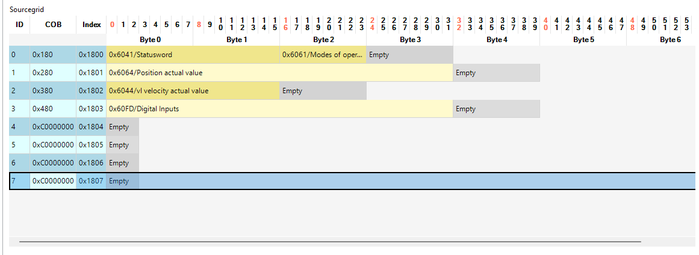
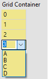
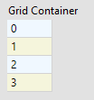
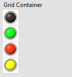
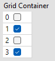
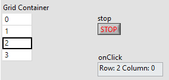
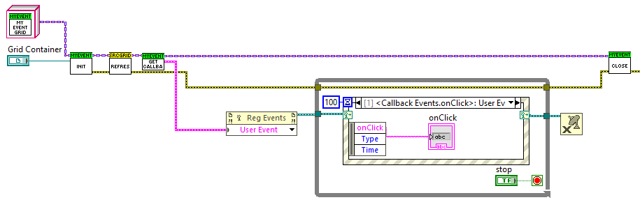

# Sourcegrid-LabVIEW Integration

This repository provides an interface for integrating Siemens [Sourcegrid](https://github.com/siemens/sourcegrid) version 2.0.0 with the .NET Framework 4.8.1 into LabVIEW through a set of accessible LabVIEW classes. This facilitates streamlined usage of Sourcegrid functionalities within LabVIEW projects.

## Features
- **Seamless Integration**: Access Siemens Sourcegrid components directly from LabVIEW.
- **Version Compatibility**: Supports Sourcegrid version 2.0.0 and .NET Framework 4.8.1.
- **LabVIEW Classes**: Predefined classes simplify the interaction with Sourcegrid functionalities.
- **Enhanced Productivity**: Enables efficient development of grid-based applications in LabVIEW.

## Requirements
To use this integration, ensure you have the following installed on your system:
1. Siemens Sourcegrid v2.0.0
2. .NET Framework 4.8.1
3. LabVIEW 21
4. [LUnit](https://github.com/Astemes/astemes-lunit) for the testing.
## Example Usage
   

   